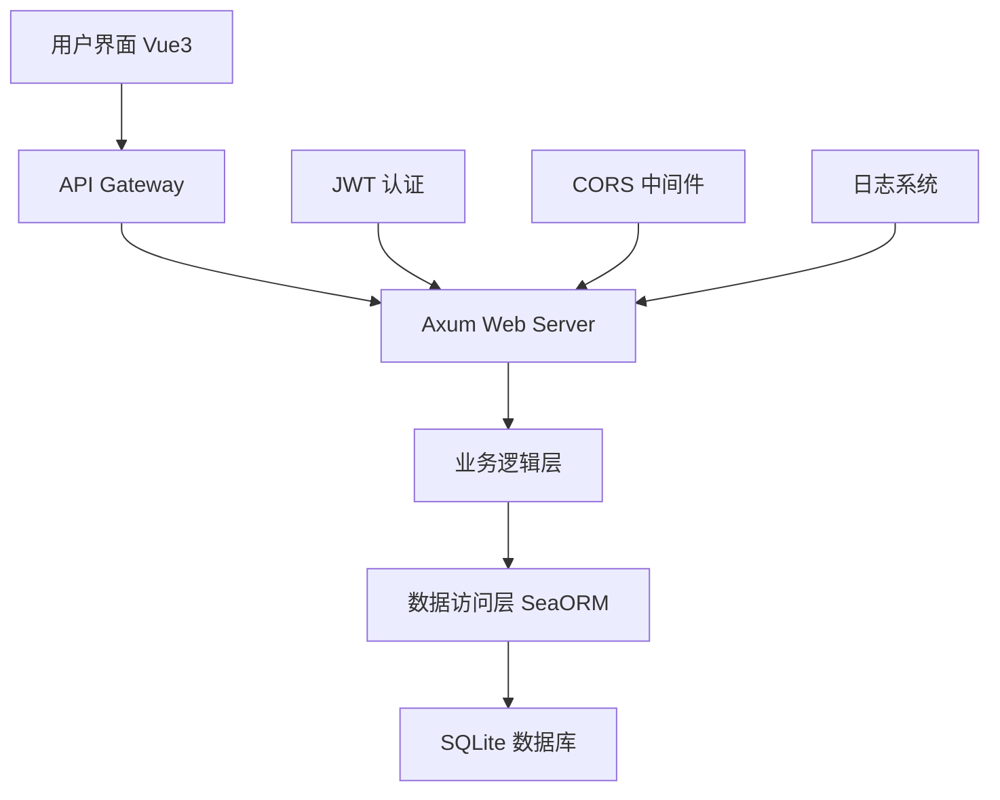
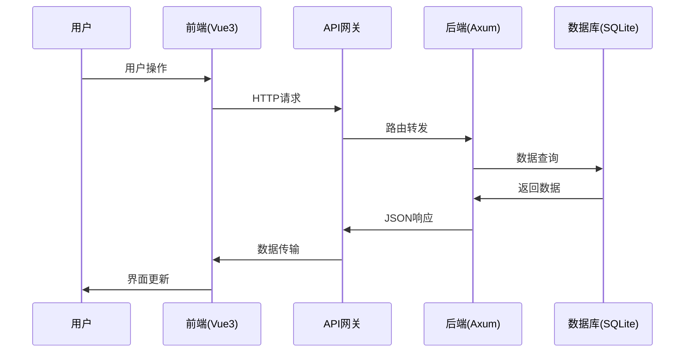
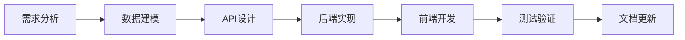
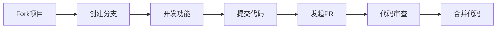

<div align="center">

# 🚀 Axum Blog Engine


**🌟 一个基于 Rust Axum 框架构建的现代化轻量级博客引擎 🌟**

*快速 • 安全 • 现代化 • 易扩展*

---

### 🛠️ 技术栈

<table>
<tr>
<td align="center">

<br><strong>后端核心</strong>
</td>
<td align="center">

<br><strong>前端框架</strong>
</td>
<td align="center">

<br><strong>数据存储</strong>
</td>
<td align="center">

<br><strong>Web框架</strong>
</td>
</tr>
</table>

### 🌐 语言支持

[🇺🇸 English](README_EN.md) | [🇨🇳 中文](README.md)

</div>

---

## 📖 目录

- [✨ 核心特性](#-核心特性)
- [🎯 快速体验](#-快速体验)
- [🛠️ 技术架构](#️-技术架构)
- [📋 系统要求](#-系统要求)
- [🚀 快速开始](#-快速开始)
- [📚 API 文档](#-api-文档)
- [🏗️ 项目结构](#️-项目结构)
- [🧪 测试指南](#-测试指南)
- [🔗 架构说明](#-架构说明)
- [🔧 开发指南](#-开发指南)
- [🚀 部署指南](#-部署指南)
- [🔮 未来规划](#-未来规划)
- [🤝 参与贡献](#-参与贡献)

---

## ✨ 核心特性

<div align="center">

### 🎨 现代化设计

</div>

<table>
<tr>
<td width="50%">

#### 🔐 **安全认证系统**
- JWT 令牌认证机制
- bcrypt 密码加密
- 角色权限管理
- 会话安全控制

#### 📝 **智能内容管理**
- Markdown 实时预览
- 文章分类标签
- 草稿自动保存
- 版本历史记录

</td>
<td width="50%">

#### 💬 **互动评论系统**
- 嵌套回复支持
- 实时消息通知
- 评论审核机制
- 表情符号支持

#### ⭐ **个性化体验**
- 文章收藏功能
- 用户偏好设置
- 阅读历史记录
- 个人主页定制

</td>
</tr>
</table>

<div align="center">

### 🚀 性能优势

| 特性 | 描述 | 优势 |
|------|------|------|
| 🔍 **全文搜索** | 基于 SQLite FTS | 毫秒级响应 |
| 👑 **管理面板** | 可视化后台管理 | 操作简便 |
| 📱 **响应式设计** | 移动端适配 | 跨设备体验 |
| ⚡ **高性能架构** | Rust 异步处理 | 并发能力强 |

</div>

---

## 🎯 快速体验

<div align="center">

### 🌟 在线演示

**[🔗 Live Demo](https://your-demo-site.com)** | **[📱 移动端预览](https://your-demo-site.com/mobile)**

*用户名: `demo` | 密码: `demo123`*

</div>

---

## 🛠️ 技术架构

<div align="center">

### 🏗️ 架构图



</div>

### 🔧 技术选型

<details>
<summary><strong>🦀 后端技术栈</strong></summary>

| 组件 | 技术 | 版本 | 说明 |
|------|------|------|------|
| **Web框架** | [Axum](https://github.com/tokio-rs/axum) | 0.7+ | 高性能异步Web框架 |
| **数据库** | SQLite | 3.35+ | 轻量级嵌入式数据库 |
| **ORM** | [SeaORM](https://www.sea-ql.org/SeaORM/) | 0.12+ | 现代化Rust ORM |
| **认证** | JWT | - | JSON Web Token认证 |
| **加密** | bcrypt | - | 密码哈希加密 |
| **日志** | tracing | - | 结构化日志系统 |
| **序列化** | serde | - | 高性能序列化框架 |
| **验证** | validator | - | 数据验证库 |

</details>

<details>
<summary><strong>🎨 前端技术栈</strong></summary>

| 组件 | 技术 | 版本 | 说明 |
|------|------|------|------|
| **框架** | [Vue 3](https://vuejs.org/) | 3.0+ | 渐进式JavaScript框架 |
| **UI库** | [Element Plus](https://element-plus.org/) | 2.0+ | Vue3组件库 |
| **构建工具** | [Vite](https://vitejs.dev/) | 4.0+ | 下一代前端构建工具 |
| **路由** | Vue Router | 4.0+ | 官方路由管理器 |
| **状态管理** | Pinia | 2.0+ | 轻量级状态管理 |
| **样式** | Less/SCSS | - | CSS预处理器 |
| **HTTP客户端** | Axios | - | Promise based HTTP库 |

</details>

---

## 📋 系统要求

<div align="center">

### 💻 开发环境

| 环境 | 最低版本 | 推荐版本 | 说明 |
|------|----------|----------|------|
| **Rust** | 1.70.0 | 1.75+ | 🦀 系统编程语言 |
| **Node.js** | 16.0.0 | 18+ | 🟢 JavaScript运行时 |
| **SQLite** | 3.35.0 | 3.40+ | 🗄️ 嵌入式数据库 |
| **Git** | 2.20+ | 2.40+ | 📝 版本控制系统 |

### 🖥️ 系统支持


</div>

---

## 🚀 快速开始

### 🎬 一键启动 (推荐)

```bash
# 🔄 克隆项目
git clone https://github.com/your-username/AxumBlogEngine.git
cd AxumBlogEngine

# 🚀 一键启动开发环境
./start-dev.sh

# 🛑 停止开发环境
./stop-dev.sh
```

<div align="center">

**🎉 启动成功后自动打开浏览器访问 [http://localhost:5173](http://localhost:5173)**

</div>

### 🔧 手动配置

<details>
<summary><strong>📦 后端设置</strong></summary>

```bash
# 进入后端目录
cd backend

# 🔨 构建项目
cargo build

# 🗄️ 初始化数据库
sqlite3 blogdb.db ".read init.sql"

# ⚙️ 配置环境变量
cat > .env << EOF
DATABASE_URL=sqlite:blogdb.db
JWT_SECRET=your-super-secret-jwt-key-here
SERVER_HOST=127.0.0.1
SERVER_PORT=3000
BCRYPT_COST=12
EOF

# 🚀 启动后端服务
cargo run --bin server
```

</details>

<details>
<summary><strong>🎨 前端设置</strong></summary>

```bash
# 进入前端目录
cd frontend

# 📦 安装依赖
npm install

# 🚀 启动开发服务器
npm run dev
```

</details>

### 🌐 访问应用

<div align="center">

| 服务 | 地址 | 说明 |
|------|------|------|
| 🎨 **前端应用** | [http://localhost:5173](http://localhost:5173) | Vue3 用户界面 |
| 🔌 **后端API** | [http://localhost:3000/api](http://localhost:3000/api) | RESTful API服务 |
| 📊 **API文档** | [http://localhost:3000/docs](http://localhost:3000/docs) | Swagger文档 |

</div>

### 👤 默认账户

<div align="center">

**🔑 管理员账户**

| 字段 | 值 |
|------|----|
| 用户名 | `admin` |
| 邮箱 | `admin@example.com` |
| 密码 | `admin123` |

> ⚠️ **安全提示**: 生产环境请立即修改默认密码！

</div>

---

## 📚 API 文档

<div align="center">

### 🔗 API 概览

**Base URL**: `http://localhost:3000/api`

**认证方式**: `Bearer Token (JWT)`

</div>

### 🔐 用户认证

<details>
<summary><strong>👤 用户管理接口</strong></summary>

| 方法 | 端点 | 描述 | 认证 | 示例 |
|------|------|------|------|------|
| `POST` | `/user/register` | 用户注册 | ❌ | [📝](#用户注册) |
| `POST` | `/user/login` | 用户登录 | ❌ | [📝](#用户登录) |
| `POST` | `/user/logout` | 用户登出 | ✅ | [📝](#用户登出) |
| `GET` | `/user/get/me` | 获取个人信息 | ✅ | [📝](#获取个人信息) |
| `PUT` | `/user/update/me` | 更新个人信息 | ✅ | [📝](#更新个人信息) |

</details>

### 📝 内容管理

<details>
<summary><strong>📄 文章管理接口</strong></summary>

| 方法 | 端点 | 描述 | 认证 | 缓存 |
|------|------|------|------|------|
| `POST` | `/post/create` | 创建文章 | ✅ | ❌ |
| `GET` | `/post/list` | 文章列表 | ❌ | ✅ 5min |
| `GET` | `/post/get/:id` | 文章详情 | ❌ | ✅ 10min |
| `PUT` | `/post/update/:id` | 更新文章 | ✅ | ❌ |
| `DELETE` | `/post/delete/:id` | 删除文章 | ✅ | ❌ |
| `GET` | `/post/search` | 搜索文章 | ❌ | ✅ 2min |

</details>

<details>
<summary><strong>💬 评论系统接口</strong></summary>

| 方法 | 端点 | 描述 | 认证 | 限流 |
|------|------|------|------|------|
| `POST` | `/comment/create` | 发表评论 | ✅ | 10/min |
| `GET` | `/comment/list/:post_id` | 评论列表 | ❌ | ❌ |
| `PUT` | `/comment/update/:id` | 编辑评论 | ✅ | 5/min |
| `DELETE` | `/comment/delete/:id` | 删除评论 | ✅ | ❌ |

</details>

<details>
<summary><strong>⭐ 收藏功能接口</strong></summary>

| 方法 | 端点 | 描述 | 认证 |
|------|------|------|------|
| `POST` | `/post_fav` | 收藏/取消收藏 | ✅ |
| `GET` | `/post_fav/my/list` | 我的收藏 | ✅ |

</details>

<details>
<summary><strong>👑 管理员接口</strong></summary>

| 方法 | 端点 | 描述 | 权限 |
|------|------|------|------|
| `GET` | `/user/get/:id` | 查看用户 | 👑 Admin |
| `POST` | `/user/create` | 创建用户 | 👑 Admin |
| `PUT` | `/user/update/:id` | 更新用户 | 👑 Admin |
| `DELETE` | `/user/delete/:id` | 删除用户 | 👑 Admin |

</details>

### 🔑 认证说明

<div align="center">

| 图标 | 说明 | 示例 |
|------|------|------|
| ❌ | 无需认证 | 公开接口 |
| ✅ | 需要JWT令牌 | `Authorization: Bearer <token>` |
| 👑 | 需要管理员权限 | Admin角色 + JWT |

</div>

---

## 🏗️ 项目结构

<div align="center">

### 📁 目录结构

</div>

```
🚀 AxumBlogEngine/
├── 📁 backend/                 # 🦀 Rust 后端服务
│   ├── 📁 src/
│   │   ├── 📁 bin/
│   │   │   └── 📄 server.rs    # 🚀 服务器入口点
│   │   ├── 📁 database/        # 🗄️ 数据访问层
│   │   │   ├── 📄 user.rs      # 👤 用户数据模型
│   │   │   ├── 📄 post.rs      # 📝 文章数据模型
│   │   │   ├── 📄 comment.rs   # 💬 评论数据模型
│   │   │   └── 📄 favorite.rs  # ⭐ 收藏数据模型
│   │   ├── 📁 handler/         # 🔧 业务逻辑层
│   │   │   ├── 📄 user.rs      # 👤 用户业务逻辑
│   │   │   ├── 📄 post.rs      # 📝 文章业务逻辑
│   │   │   ├── 📄 comment.rs   # 💬 评论业务逻辑
│   │   │   └── 📄 favorite.rs  # ⭐ 收藏业务逻辑
│   │   ├── 📄 error.rs         # ❌ 错误处理
│   │   └── 📄 lib.rs           # 📚 库入口文件
│   ├── 📁 tests/               # 🧪 测试文件
│   │   ├── 📄 user_test.rs     # 👤 用户模块测试
│   │   ├── 📄 post_test.rs     # 📝 文章模块测试
│   │   ├── 📄 comment_test.rs  # 💬 评论模块测试
│   │   └── 📄 favorite_test.rs # ⭐ 收藏模块测试
│   ├── 📄 init.sql             # 🗄️ 数据库初始化脚本
│   ├── 📄 Cargo.toml           # 📦 Rust 依赖配置
│   └── 📄 .env                 # ⚙️ 环境变量配置
├── 📁 frontend/                # 🎨 Vue3 前端应用
│   ├── 📁 src/
│   │   ├── 📁 view/            # 📱 页面组件
│   │   │   ├── 📄 Home.vue     # 🏠 首页
│   │   │   ├── 📄 Login.vue    # 🔐 登录页
│   │   │   ├── 📄 Post.vue     # 📝 文章页
│   │   │   └── 📄 Admin.vue    # 👑 管理页
│   │   ├── 📁 router/          # 🛣️ 路由配置
│   │   ├── 📁 api/             # 🔌 API 接口
│   │   ├── 📁 assets/          # 🖼️ 静态资源
│   │   ├── 📁 components/      # 🧩 公共组件
│   │   ├── 📄 App.vue          # 🎯 根组件
│   │   └── 📄 main.js          # 🚀 应用入口
│   ├── 📄 package.json         # 📦 Node.js 依赖
│   └── 📄 vite.config.js       # ⚙️ Vite 配置
├── 📁 docs/                    # 📖 项目文档
├── 📁 scripts/                 # 🔧 构建脚本
├── 📄 start-dev.sh             # 🚀 开发环境启动
├── 📄 stop-dev.sh              # 🛑 开发环境停止
├── 📄 docker-compose.yml       # 🐳 Docker 编排
└── 📄 README.md                # 📖 项目说明
```

---

## 🧪 测试指南

<div align="center">

### 🎯 测试覆盖率


</div>

### 🔬 运行测试

<details>
<summary><strong>🧪 完整测试套件</strong></summary>

```bash
# 🏃‍♂️ 运行所有测试
cd backend
cargo test

# 📊 生成测试报告
cargo test -- --nocapture

# 🔍 详细测试输出
cargo test -- --show-output
```

</details>

<details>
<summary><strong>🎯 模块化测试</strong></summary>

```bash
# 👤 用户模块测试
cargo test user_test

# 📝 文章模块测试
cargo test post_test

# 💬 评论模块测试
cargo test comment_test

# ⭐ 收藏模块测试
cargo test favorite_test
```

</details>

<details>
<summary><strong>🔍 单元测试</strong></summary>

```bash
# 🧪 特定测试用例
cargo test test_create_user_from_register
cargo test test_user_login_success
cargo test test_create_post_with_auth
```

</details>

### 📈 性能测试

```bash
# 🚀 压力测试
./scripts/load-test.sh

# 📊 性能基准测试
cargo bench
```

---

## 🔗 架构说明

<div align="center">

### 🏗️ 系统架构

</div>

### 🌐 前后端分离架构

<table>
<tr>
<td width="50%">

#### 🎨 **前端层 (Vue3)**
- **端口**: 5173
- **技术**: Vue3 + Vite + Element Plus
- **职责**: 用户界面渲染与交互
- **特性**: SPA单页应用，响应式设计

</td>
<td width="50%">

#### 🔧 **后端层 (Axum)**
- **端口**: 3000
- **技术**: Rust + Axum + SeaORM
- **职责**: API服务与业务逻辑
- **特性**: 高并发，内存安全

</td>
</tr>
</table>

### 🔄 数据流程



### 🔐 认证流程

<details>
<summary><strong>🔑 JWT认证机制</strong></summary>

1. **用户登录** → 验证用户名密码
2. **生成Token** → 服务器签发JWT令牌
3. **存储Token** → 前端localStorage保存
4. **请求携带** → API请求自动附加Authorization头
5. **Token验证** → 后端中间件验证令牌有效性
6. **权限检查** → 根据用户角色进行权限控制

</details>

### 🌐 跨域处理

<details>
<summary><strong>🔧 CORS配置</strong></summary>

```rust
// 后端CORS中间件配置
let cors = CorsLayer::new()
    .allow_origin("http://localhost:5173".parse::<HeaderValue>().unwrap())
    .allow_methods([Method::GET, Method::POST, Method::PUT, Method::DELETE])
    .allow_headers([AUTHORIZATION, CONTENT_TYPE]);
```

</details>

---

## 🔧 开发指南

### 🚀 添加新功能

<div align="center">

### 📋 开发流程

</div>



<details>
<summary><strong>🔧 后端开发步骤</strong></summary>

1. **📊 数据层**: 在 `backend/src/database/` 添加数据模型
2. **🔧 业务层**: 在 `backend/src/handler/` 实现业务逻辑
3. **🛣️ 路由层**: 在 `backend/src/bin/server.rs` 注册路由
4. **🧪 测试层**: 在 `backend/tests/` 编写测试用例

</details>

<details>
<summary><strong>🎨 前端开发步骤</strong></summary>

1. **🔌 API层**: 在 `frontend/src/api/` 添加API调用
2. **📱 组件层**: 在 `frontend/src/view/` 创建页面组件
3. **🛣️ 路由层**: 在 `frontend/src/router/` 配置路由
4. **🎨 样式层**: 添加组件样式和主题

</details>

### 📏 代码规范

<div align="center">

### 🔍 质量检查

| 工具 | 用途 | 命令 |
|------|------|------|
| `cargo fmt` | 🎨 代码格式化 | `cargo fmt --all` |
| `cargo clippy` | 🔍 代码检查 | `cargo clippy --all-targets` |
| `cargo test` | 🧪 单元测试 | `cargo test --all` |
| `eslint` | 🔍 JS代码检查 | `npm run lint` |
| `prettier` | 🎨 JS代码格式化 | `npm run format` |

</div>

### 📝 提交规范

```bash
# 🎯 提交格式
git commit -m "<type>(<scope>): <description>"

# 📝 示例
git commit -m "feat(auth): add JWT token refresh mechanism"
git commit -m "fix(api): resolve user registration validation issue"
git commit -m "docs(readme): update installation instructions"
```

<details>
<summary><strong>📋 提交类型说明</strong></summary>

| 类型 | 说明 | 示例 |
|------|------|------|
| `feat` | ✨ 新功能 | `feat(auth): add OAuth login` |
| `fix` | 🐛 修复bug | `fix(api): resolve CORS issue` |
| `docs` | 📚 文档更新 | `docs(api): update endpoint docs` |
| `style` | 🎨 代码格式 | `style: fix indentation` |
| `refactor` | ♻️ 重构代码 | `refactor(db): optimize queries` |
| `test` | 🧪 测试相关 | `test(user): add login tests` |
| `chore` | 🔧 构建/工具 | `chore: update dependencies` |

</details>

---

## 🚀 部署指南

### 🌐 生产环境部署

<details>
<summary><strong>🔨 手动部署</strong></summary>

```bash
# 🏗️ 构建后端
cd backend
cargo build --release

# 🎨 构建前端
cd ../frontend
npm run build

# ⚙️ 配置环境变量
cat > .env.production << EOF
DATABASE_URL=sqlite:blogdb.db
JWT_SECRET=your-production-secret-key
SERVER_HOST=0.0.0.0
SERVER_PORT=3000
RUST_LOG=info
EOF

# 🚀 启动服务
./target/release/server
```

</details>

### 🐳 Docker 部署

<details>
<summary><strong>🐳 Docker Compose 部署</strong></summary>

```yaml
# docker-compose.yml
version: '3.8'
services:
  backend:
    build: ./backend
    ports:
      - "3000:3000"
    environment:
      - DATABASE_URL=sqlite:blogdb.db
      - JWT_SECRET=${JWT_SECRET}
    volumes:
      - ./data:/app/data
  
  frontend:
    build: ./frontend
    ports:
      - "80:80"
    depends_on:
      - backend
```

```bash
# 🚀 一键部署
docker-compose up -d

# 📊 查看状态
docker-compose ps

# 📋 查看日志
docker-compose logs -f
```

</details>

### ☁️ 云平台部署

<div align="center">

### 🌐 支持的云平台

| 平台 | 状态 | 文档链接 |
|------|------|----------|
| **Vercel** | ✅ 支持 | [部署指南](docs/deploy-vercel.md) |
| **Railway** | ✅ 支持 | [部署指南](docs/deploy-railway.md) |
| **Fly.io** | ✅ 支持 | [部署指南](docs/deploy-fly.md) |
| **AWS** | 🔄 计划中 | [部署指南](docs/deploy-aws.md) |
| **阿里云** | 🔄 计划中 | [部署指南](docs/deploy-aliyun.md) |

</div>

---

## 🔮 未来规划

<div align="center">

### 🗓️ 开发路线图

</div>

### 📅 Version 1.1 (Q1 2024)

- [ ] 🔄 **Redis缓存支持** - 提升性能
- [ ] 📧 **邮件通知系统** - 评论/回复通知
- [ ] 🖼️ **图片上传功能** - 支持文章配图
- [ ] 🏷️ **标签系统** - 文章标签分类

### 📅 Version 1.2 (Q2 2024)

- [ ] 📊 **数据统计面板** - 访问量统计
- [ ] 🌐 **多语言支持** - 国际化i18n
- [ ] 🔍 **全文搜索优化** - Elasticsearch集成
- [ ] 👥 **社交功能** - 用户关注/粉丝

### 📅 Version 2.0 (Q3 2024)

- [ ] 📱 **移动端App** - React Native
- [ ] 🔌 **插件系统** - 可扩展架构
- [ ] 🤖 **AI助手** - 智能写作建议
- [ ] 🔐 **OAuth集成** - 第三方登录

<div align="center">

### 🎯 长期目标

**打造最好用的Rust博客引擎** 🚀

</div>

---

## 🤝 参与贡献

<div align="center">

### 💝 欢迎贡献

**我们欢迎任何形式的贡献！**

</div>

### 🔧 贡献方式

<table>
<tr>
<td width="50%">

#### 💻 **代码贡献**
- 🐛 修复Bug
- ✨ 新增功能
- ♻️ 代码重构
- 🎨 UI/UX改进

</td>
<td width="50%">

#### 📚 **非代码贡献**
- 📖 完善文档
- 🌐 翻译工作
- 🧪 测试反馈
- 💡 功能建议

</td>
</tr>
</table>

### 📋 贡献流程



<details>
<summary><strong>📝 详细步骤</strong></summary>

1. **🍴 Fork 项目**
   ```bash
   git clone https://github.com/your-username/AxumBlogEngine.git
   ```

2. **🌿 创建特性分支**
   ```bash
   git checkout -b feature/amazing-feature
   ```

3. **💻 开发功能**
   - 编写代码
   - 添加测试
   - 更新文档

4. **📝 提交更改**
   ```bash
   git commit -m "feat: add amazing feature"
   ```

5. **🚀 推送分支**
   ```bash
   git push origin feature/amazing-feature
   ```

6. **🔄 发起 Pull Request**
   - 详细描述更改内容
   - 关联相关Issue
   - 等待代码审查

</details>

### 👥 贡献者

<div align="center">

**感谢所有贡献者！** 🙏

<a href="https://github.com/your-username/AxumBlogEngine/graphs/contributors">
  
</a>

</div>

### 📞 联系我们

<div align="center">

| 方式 | 链接 |
|------|------|
| 📧 **邮箱** | [team@axumblog.com](mailto:team@axumblog.com) |
| 💬 **讨论** | [GitHub Discussions](https://github.com/your-username/AxumBlogEngine/discussions) |
| 🐛 **问题反馈** | [GitHub Issues](https://github.com/your-username/AxumBlogEngine/issues) |
| 📱 **QQ群** | 123456789 |
| 💬 **微信群** | 扫码加入 |

</div>

---

## 📖 参考文档

<div align="center">

### 📚 学习资源

</div>

<table>
<tr>
<td width="50%">

#### 🦀 **Rust 生态**
- [📖 Rust 官方文档](https://doc.rust-lang.org/)
- [🚀 Axum 框架文档](https://docs.rs/axum/latest/axum/)
- [🌊 SeaORM 文档](https://www.sea-ql.org/SeaORM/)
- [🔧 Tokio 异步运行时](https://tokio.rs/)

</td>
<td width="50%">

#### 🎨 **前端技术**
- [💚 Vue 3 官方文档](https://vuejs.org/guide/)
- [🎯 Element Plus 组件库](https://element-plus.org/)
- [⚡ Vite 构建工具](https://vitejs.dev/)
- [🛣️ Vue Router 路由](https://router.vuejs.org/)

</td>
</tr>
</table>

### 📖 扩展阅读

<details>
<summary><strong>📚 推荐书籍</strong></summary>

- 📖 《Rust程序设计语言》
- 📖 《Vue.js设计与实现》
- 📖 《现代Web开发实战》
- 📖 《微服务架构设计模式》

</details>

<details>
<summary><strong>🎥 视频教程</strong></summary>

- 🎥 [Rust入门到精通](https://example.com)
- 🎥 [Vue3实战教程](https://example.com)
- 🎥 [全栈开发指南](https://example.com)

</details>

---

## 📄 许可证

<div align="center">

### 📜 MIT License

**本项目采用 MIT 许可证开源**

[](https://opensource.org/licenses/MIT)

[📄 查看完整许可证](LICENSE)

</div>

---

## 🙏 致谢

<div align="center">

### 💝 特别感谢

**感谢以下开源项目和社区的支持！**

<table>
<tr>
<td align="center">

<br><strong>Rust Community</strong>
</td>
<td align="center">

<br><strong>Vue.js Team</strong>
</td>
<td align="center">

<br><strong>Tokio Team</strong>
</td>
<td align="center">

<br><strong>SeaQL Team</strong>
</td>
</tr>
</table>

### 🌟 支持我们

**如果这个项目对你有帮助，请考虑：**

⭐ **给项目点个Star** | 🔄 **分享给朋友** | 💰 **赞助开发**

---

### 📊 项目统计


---

<h2 align="center">🚀 开始你的博客之旅吧！</h2>

**[⬆️ 回到顶部](#-axum-blog-engine)**

</div>
