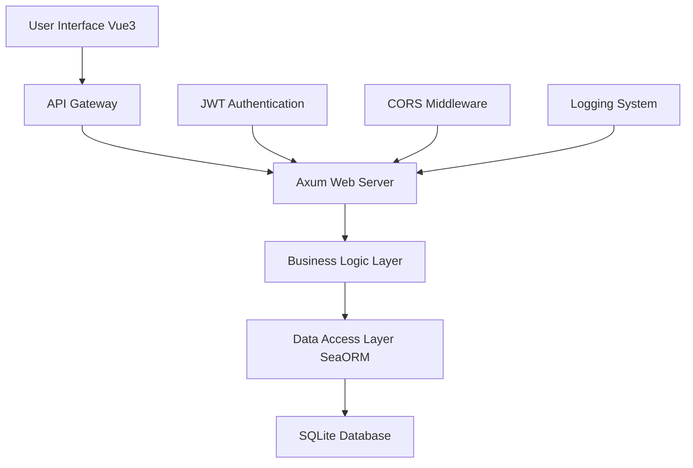
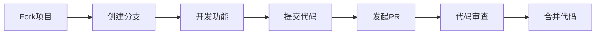

<div align="center">

# 🚀 Axum Blog Engine


**🌟 A modern lightweight blog engine built on the Rust Axum framework 🌟**

*Fast • Secure • Modern • Extensible*

---

### 🛠️ Technology Stack

<table>
<tr>
<td align="center">

<br><strong>Backend Core</strong>
</td>
<td align="center">

<br><strong>Frontend Framework</strong>
</td>
<td align="center">

<br><strong>Data Storage</strong>
</td>
<td align="center">

<br><strong>Web Framework</strong>
</td>
</tr>
</table>

### 🌐 Language Support

[🇺🇸 English](README_EN.md) | [🇨🇳 Chinese](README.md)

</div>

---

## 📖 Table of Contents

- [✨ Core Features](#-core-features)
- [🎯 Page Display](#-page-display)
- [🛠️ Technical Architecture](#️-technical-architecture)
- [📋 System Requirements](#-system-requirements)
- [🚀 Quick Start](#-quick-start)
- [📚 API Documentation](#-api-documentation)
- [🏗️ Project Structure](#️-project-structure)
- [🧪 Testing Guide](#-testing-guide)
- [🔗 Architecture Notes](#-architecture-notes)
- [🔧 Development Guide](#-development-guide)
- [🚀 Deployment Guide](#-deployment-guide)
- [🔮 Future Plans](#-future-plans)
- [🤝 Contributing](#-contributing)

---

## ✨ Core Features

<div align="center">

### 🎨 Modern Design

</div>

<table>
<tr>
<td width="50%">

#### 🔐 **Secure Authentication System**
- JWT Token Authentication Mechanism
- bcrypt Password Encryption
- Role-based Permission Management
- Session Security Control

#### 📝 **Intelligent Content Management**
- Markdown Real-time Preview
- Post Categories and Tags
- Automatic Draft Saving
- Version History

</td>
<td width="50%">

#### 💬 **Interactive Comment System**
- Nested Reply Support
- Real-time Notifications
- Comment Moderation Mechanism
- Emoji Support

#### ⭐ **Personalized Experience**
- Article Collection Feature
- User Preferences
- Reading History
- Personal Homepage Customization

</td>
</tr>
</table>

<div align="center">

### 🚀 Performance Advantages

| Feature | Description | Advantage |
|------|------|------|
| 🔍 **Full-text Search** | Based on SQLite FTS | Millisecond-level Response |
| 👑 **Admin Panel** | Visualized Backend Management | Easy to Operate |
| 📱 **Responsive Design** | Mobile Adaptation | Cross-device Experience |
| ⚡ **High-performance Architecture** | Rust Asynchronous Processing | Strong Concurrency |

</div>

---

## 🎯 Page Display

<div align="center">

### 🌟 Homepage Display


### 🌟 New Post Display

</div>

---

## 🛠️ Technical Architecture

<div align="center">

### 🏗️ Architecture Diagram



</div>


### 🔧 Technology Selection

<details>
<summary><strong>🦀 Backend Technology Stack</strong></summary>

| Component | Technology | Version | Description |
|------|------|------|------|
| **Web Framework** | [Axum](https://github.com/tokio-rs/axum) | 0.7+ | High-performance Asynchronous Web Framework |
| **Database** | SQLite | 3.35+ | Lightweight Embedded Database |
| **ORM** | [SeaORM](https://www.sea-ql.org/SeaORM/) | 0.12+ | Modern Rust ORM |
| **Authentication** | JWT | - | JSON Web Token Authentication |
| **Encryption** | bcrypt | - | Password Hashing Encryption |
| **Logging** | tracing | - | Structured Logging System |
| **Serialization** | serde | - | High-performance Serialization Framework |
| **Validation** | validator | - | Data Validation Library |

</details>

<details>
<summary><strong>🎨 Frontend Technology Stack</strong></summary>

| Component | Technology | Version | Description |
|------|------|------|------|
| **Framework** | [Vue 3](https://vuejs.org/) | 3.0+ | Progressive JavaScript Framework |
| **UI Library** | [Element Plus](https://element-plus.org/) | 2.0+ | Vue3 Component Library |
| **Build Tool** | [Vite](https://vitejs.dev/) | 4.0+ | Next-generation Frontend Build Tool |
| **Routing** | Vue Router | 4.0+ | Official Router Manager |
| **State Management** | Pinia | 2.0+ | Lightweight State Management |
| **Styles** | Less/SCSS | - | CSS Preprocessor |
| **HTTP Client** | Axios | - | Promise-based HTTP Library |

</details>

---

## 📋 System Requirements

<div align="center">

### 💻 Development Environment

| Environment | Minimum Version | Recommended Version | Description |
|------|----------|----------|------|
| **Rust** | 1.70.0 | 1.75+ | 🦀 System Programming Language |
| **Node.js** | 16.0.0 | 18+ | 🟢 JavaScript Runtime |
| **SQLite** | 3.35.0 | 3.40+ | 🗄️ Embedded Database |
| **Git** | 2.20+ | 2.40+ | 📝 Version Control System |

### 🖥️ System Support


</div>

---

## 🚀 Quick Start

### 🎬 One-Click Start (Recommended)

```bash
# 🔄 Clone Project
git clone [https://github.com/vexillium2/AxumBlogEngine.git](https://github.com/vexillium2/AxumBlogEngine.git)
cd AxumBlogEngine

# 🚀 One-click Start Development Environment
./start-dev.sh

# 🛑 Stop Development Environment
./stop-dev.sh
```
<div align="center">

**🎉 Automatically open browser after successful startup [http://localhost:5173](http://localhost:5173)**

</div>

### 🔧 Manual Configuration

<details>
<summary><strong>📦 Backend Setup</strong></summary>

```bash
# Go to the backend directory
cd backend

# 🔨 Build the project
cargo build

# 🗄️ Initialize the database
sqlite3 blogdb.db ".read init.sql"

# ⚙️ Configure environment variables
cat > .env << EOF
DATABASE_URL=sqlite:blogdb.db
JWT_SECRET=your-super-secret-jwt-key-here
SERVER_HOST=127.0.0.1
SERVER_PORT=3000
BCRYPT_COST=12
EOF

# 🚀 Start the backend service
cargo run --bin server
```
</details>

<details>
<summary><strong>🎨 Frontend Setup</strong></summary>

```bash
# Enter frontend directory
cd frontend

# 📦 Install Dependencies
npm install

# 🚀 Start Development Server
npm run dev
```
</details>

### 🌐 Access Application

<div align="center">

| Service | Address | Description |
|------|------|------|
| 🎨 **Frontend Application** | [http://localhost:5173](http://localhost:5173) | Vue3 User Interface |
| 🔌 **Backend API** | [http://localhost:3000/api](http://localhost:3000/api) | RESTful API Service |
| 📊 **API Documentation** | [http://localhost:3000/docs](http://localhost:3000/docs) | Swagger Documentation |

</div>

### 👤 Default Account

<div align="center">

**🔑 Administrator Account**

| Field | Value |
|------|----|
| Username | `admin` |
| Email | `admin@example.com` |
| Password | `admin123` |

> ⚠️ **Security Notice**: Please change the default password immediately in a production environment!

</div>

---

## 📚 API Documentation

<div align="center">

### 🔗 API Overview

**Base URL**: `http://localhost:3000/api`

**Authentication Method**: `Bearer Token (JWT)`

</div>

### 🔐 User Authentication

<details>
<summary><strong>👤 User Management API</strong></summary>

| Method | Endpoint | Description | Authentication | Example |
|------|------|------|------|------|
| `POST` | `/user/register` | User Registration | ❌ | [📝](#用户注册) |
| `POST` | `/user/login` | User Login | ❌ | [📝](#用户登录) |
| `POST` | `/user/logout` | User Logout | ✅ | [📝](#用户登出) |
| `GET` | `/user/get/me` | Get Personal Information | ✅ | [📝](#获取个人信息) |
| `PUT` | `/user/update/me` | Update Personal Information | ✅ | [📝](#更新个人信息) |

</details>

### 📝 Content Management

<details>
<summary><strong>📄 Post Management API</strong></summary>

| Method | Endpoint | Description | Authentication | Cache |
|------|------|------|------|------|
| `POST` | `/post/create` | Create Post | ✅ | ❌ |
| `GET` | `/post/list` | Post List | ❌ | ✅ 5min |
| `GET` | `/post/get/:id` | Post Details | ❌ | ✅ 10min |
| `PUT` | `/post/update/:id` | Update Post | ✅ | ❌ |
| `DELETE` | `/post/delete/:id` | Delete Post | ✅ | ❌ |
| `GET` | `/post/search` | Search Posts | ❌ | ✅ 2min |

</details>

<details>
<summary><strong>💬 Comment System API</strong></summary>

| Method | Endpoint | Description | Authentication | Rate Limiting |
|------|------|------|------|------|
| `POST` | `/comment/create` | Post Comment | ✅ | 10/min |
| `GET` | `/comment/list/:post_id` | Comment List | ❌ | ❌ |
| `PUT` | `/comment/update/:id` | Edit Comment | ✅ | 5/min |
| `DELETE` | `/comment/delete/:id` | Delete Comment | ✅ | ❌ |

</details>

<details>
<summary><strong>⭐ Favorite Feature API</strong></summary>

| Method | Endpoint | Description | Authentication |
|------|------|------|------|
| `POST` | `/post_fav` | Favorite/Unfavorite | ✅ |
| `GET` | `/post_fav/my/list` | My Favorites | ✅ |

</details>

<details>
<summary><strong>👑 Admin API</strong></summary>

| Method | Endpoint | Description | Permission |
|------|------|------|------|
| `GET` | `/user/get/:id` | View User | 👑 Admin |
| `POST` | `/user/create` | Create User | 👑 Admin |
| `PUT` | `/user/update/:id` | Update User | 👑 Admin |
| `DELETE` | `/user/delete/:id` | Delete User | 👑 Admin |

</details>

### 🔑 Authentication Notes

<div align="center">

| Icon | Description | Example |
|------|------|------|
| ❌ | No Authentication Required | Public API |
| ✅ | Requires JWT Token | `Authorization: Bearer <token>` |
| 👑 | Requires Admin Privileges | Admin Role + JWT |

</div>

---

## 🏗️ Project Structure

<div align="center">

### 📁 Directory Structure

</div>

```
🚀 AxumBlogEngine/
├── 📁 backend/                 # 🦀 Rust Backend Service
│   ├── 📁 src/
│   │   ├── 📁 bin/
│   │   │   └── 📄 server.rs    # 🚀 Server Entry Point
│   │   ├── 📁 database/        # 🗄️ Data Access Layer
│   │   │   ├── 📄 user.rs      # 👤 User Data Model
│   │   │   ├── 📄 post.rs      # 📝 Post Data Model
│   │   │   ├── 📄 comment.rs   # 💬 Comment Data Model
│   │   │   └── 📄 favorite.rs  # ⭐ Favorite Data Model
│   │   ├── 📁 handler/         # 🔧 Business Logic Layer
│   │   │   ├── 📄 user.rs      # 👤 User Business Logic
│   │   │   ├── 📄 post.rs      # 📝 Post Business Logic
│   │   │   ├── 📄 comment.rs   # 💬 Comment Business Logic
│   │   │   └── 📄 favorite.rs  # ⭐ Favorite Business Logic
│   │   ├── 📄 error.rs         # ❌ Error Handling
│   │   └── 📄 lib.rs           # 📚 Library Entry File
│   ├── 📁 tests/               # 🧪 Test Files
│   │   ├── 📄 user_test.rs     # 👤 User Module Tests
│   │   ├── 📄 post_test.rs     # 📝 Post Module Tests
│   │   ├── 📄 comment_test.rs  # 💬 Comment Module Tests
│   │   └── 📄 favorite_test.rs # ⭐ Favorite Module Tests
│   ├── 📄 init.sql             # 🗄️ Database Initialization Script
│   ├── 📄 Cargo.toml           # 📦 Rust Dependency Configuration
│   └── 📄 .env                 # ⚙️ Environment Variable Configuration
├── 📁 frontend/                # 🎨 Vue3 Frontend Application
│   ├── 📁 src/
│   │   ├── 📁 view/            # 📱 Page Components
│   │   │   ├── 📄 Home.vue     # 🏠 Homepage
│   │   │   ├── 📄 Login.vue    # 🔐 Login Page
│   │   │   ├── 📄 Post.vue     # 📝 Post Page
│   │   │   └── 📄 Admin.vue    # 👑 Admin Page
│   │   ├── 📁 router/          # 🛣️ Route Configuration
│   │   ├── 📁 api/             # 🔌 API Interfaces
│   │   ├── 📁 assets/          # 🖼️ Static Assets
│   │   ├── 📁 components/      # 🧩 Common Components
│   │   ├── 📄 App.vue          # 🎯 Root Component
│   │   └── 📄 main.js          # 🚀 Application Entry
│   ├── 📄 package.json         # 📦 Node.js Dependencies
│   └── 📄 vite.config.js       # ⚙️ Vite Configuration
├── 📁 docs/                    # 📖 Project Documentation
├── 📁 scripts/                 # 🔧 Build Scripts
├── 📄 start-dev.sh             # 🚀 Start Development Environment
├── 📄 stop-dev.sh              # 🛑 Stop Development Environment
├── 📄 docker-compose.yml       # 🐳 Docker Orchestration
└── 📄 README.md                # 📖 Project Description
```

-----
## 🧪 Testing Guide

<div align="center">

### 🎯 Test Coverage


</div>

### 🔬 Run Tests

<details>
<summary><strong>🧪 Full Test Suite</strong></summary>

```bash
# 🏃‍♂️ Run all tests
cd backend
cargo test

# 📊 Generate test report
cargo test -- --nocapture

# 🔍 Detailed test output
cargo test -- --show-output
```
</details>

## 🤝 Contributing

<div align="center">

### 💝 Welcome Contributions

**We welcome contributions of any kind!**

</div>

### 🔧 Ways to Contribute

<table>
<tr>
<td width="50%">

#### 💻 **Code Contributions**
- 🐛 Fix Bugs
- ✨ Add New Features
- ♻️ Refactor Code
- 🎨 UI/UX Improvements

</td>
<td width="50%">

#### 📚 **Non-Code Contributions**
- 📖 Improve Documentation
- 🌐 Translation Work
- 🧪 Test Feedback
- 💡 Feature Suggestions

</td>
</tr>
</table>

### 📋 Contribution Workflow



<details>

<summary><strong>📝 Detailed Steps</strong></summary>

1.  **🍴 Fork Project**
    ```bash
    git clone [https://github.com/vexillium2/AxumBlogEngine.git](https://github.com/vexillium2/AxumBlogEngine.git)
    ```
    

2.  **🌿 Create Feature Branch**
    ```bash
    git checkout -b feature/amazing-feature
    ```
    

3.  **💻 Develop Feature**
    * Write Code
    * Add Tests
    * Update Documentation

4.  **📝 Commit Changes**
    ```bash
    git commit -m "feat: add amazing feature"
    ```
    

5.  **🚀 Push Branch**
    ```bash
    git push origin feature/amazing-feature
    ```
    

6.  **🔄 Create Pull Request**
    * Detailed description of changes
    * Link related Issues
    * Wait for code review

</details>

### 👥 Contributors

<div align="center">

**Thanks to all contributors!** 🙏 This is a large and complex development task, and the success of the project is inseparable from the joint efforts of every member. 💪 Our team members are not limited to their respective responsibilities, but are deeply involved in all aspects of the project and make an equal and equally important contribution. 🚀

<br>

| Contributor Avatar | Contributor Name | GitHub Homepage | Responsible Work |
| :-------: | :-------: | :---------: | :---------: |
|  | [杜嘉康](https://github.com/vexillium2) | [访问](https://github.com/vexillium2) | Idea Proposal, Requirements and Documentation, Back-end |
|  | [王国杰](https://github.com/suooous) | [访问](https://github.com/suooous) | Front-end, Document Diagramming, API Documentation |
|  | [覃昶](https://github.com/TianJi666) | [访问](https://github.com/TianJi666) | Back-end, Testing, System Testing Documentation. |
|  | [钟伟明](https://github.com/zzy443320) | [访问](https://github.com/zzy443320) | Front-end, Testing, Presentation Documentation |

</div>

### 📞 Contact Us

<div align="center">

| Method | Link |
|------|------|
| 💬 **Discussions** | [GitHub Discussions](https://github.com/vexillium2/AxumBlogEngine/discussions) |
| 🐛 **Issue Feedback** | [GitHub Issues](https://github.com/vexillium2/AxumBlogEngine/issues) |

</div>

<div align="center">

### 💝 Special Thanks

**Thanks to the following open-source projects and communities for their support!**

<table>
<tr>
<td align="center">

<br><strong>Rust Community</strong>
</td>
<td align="center">

<br><strong>Vue.js Team</strong>
</td>
<td align="center">

<br><strong>Tokio Team</strong>
</td>
<td align="center">

<br><strong>SeaQL Team</strong>
</td>
</tr>
</table>

### 🌟 Support Us

**If this project is helpful to you, please consider:**

⭐ **Give the project a Star** | 🔄 **Share with friends** | 💰 **Sponsor Development**

---

### 📊 Project Statistics


---

<h2 align="center">🚀 Start your blogging journey!</h2>

**[⬆️ Back to Top](#-axum-blog-engine)**

</div>

